# Marthi-et-al-2025-MedVisionLlama-Pre-Trained-LLM-Layers-to-Enhance-Medical-Image-Segmentation

> Bilingual paper reproduction report for **MedVisionLlama: Leveraging Pre-Trained Large Language Model Layers to Enhance Medical Image Segmentation**

---

## 中文简介

本仓库记录了我对论文 **MedVisionLlama: Leveraging Pre-Trained Large Language Model Layers to Enhance Medical Image Segmentation** 的复现过程，包括：

- 原始仓库环境恢复
- 训练 / 验证 / 测试链路排障
- `ViT_Baseline` 与 `MedVisionLlama` 的对照实验
- 单卡环境下的多组设置验证
- 曲线、CSV、结果分析与复现总结

本项目并不把“代码跑通”视为复现终点，而是尽可能在有限算力条件下，完成**工程复现 + 阶段性科学验证**。

---

## English Overview

This repository documents my reproduction of the paper:

**MedVisionLlama: Leveraging Pre-Trained Large Language Model Layers to Enhance Medical Image Segmentation**

The project includes:

- environment recovery
- debugging the training / validation / testing pipeline
- controlled comparisons between `ViT_Baseline` and `MedVisionLlama`
- multiple single-GPU experiment settings
- result logging, curve visualization, and reproduction analysis

This repository is intended not only to show that the code runs, but also to provide an **engineering reproduction with partial scientific validation** under constrained compute.

---

# 1. Original Paper / 原论文

**Title**  
MedVisionLlama: Leveraging Pre-Trained Large Language Model Layers to Enhance Medical Image Segmentation

**Main idea / 核心思想**  
The paper incorporates frozen layers from a pre-trained large language model into a medical segmentation framework, aiming to enhance feature refinement and improve segmentation, especially under limited data settings.

论文尝试将预训练大语言模型中的冻结层引入医学图像分割框架，在低数据场景下提升分割能力。

---

# 2. Reproduction Scope / 复现范围

## 中文

由于本复现使用的是**单卡 RTX PRO 6000 ×1**，因此采用了**分阶段复现策略**，而不是直接追求论文原始大规模实验的完全一致。

当前已完成内容包括：

- `ViT_Baseline` 跑通
- `MedVisionLlama` 跑通
- Llama 权重加载成功
- `Task01_BrainTumour` 多组实验完成
- 训练曲线 / CSV / 测试指标保存
- 关键工程问题修复

## English

Because this reproduction was conducted on **a single RTX PRO 6000 GPU**, I adopted a staged strategy instead of directly targeting a full-scale replication of the original large-compute setup.

Completed scope includes:

- successful runs of `ViT_Baseline`
- successful runs of `MedVisionLlama`
- successful loading of Llama checkpoints
- multiple experiments on `Task01_BrainTumour`
- saved curves / CSV logs / test metrics
- major engineering bug fixes

---

# 3. Hardware and Environment / 硬件与环境

## Hardware / 硬件

- GPU: **RTX PRO 6000 ×1**
- Batch size: `1`

## Software / 软件

- Python
- PyTorch
- MONAI / related medical imaging dependencies
- custom environment: `medvision_env`

---

# 4. Dataset / 数据集

主要实验数据集：

- `Task01_BrainTumour`

Main dataset used in this reproduction:

- `Task01_BrainTumour`

Common settings:

- `data_file = ./Task01_BrainTumour/dataset.json`
- `image_size = 128,128,128`
- `patch_size = 8,8,8`

---

# 5. Key Engineering Fixes / 关键工程修复

## 中文

在正式实验前，我对原始仓库做了多处关键修复：

### 5.1 OutputProjection 修复
原始 `OutputProjection` 使用 `unfoldNd.FoldNd`，在实际运行中会触发 CUDA scatter/gather 越界错误。  
我将其改为：

- `Linear`
- reshape 到 patch grid
- permute
- reshape 回 `[B, C, H, W, D]`

### 5.2 Metrics 修复
原始 `nsd_score` 容易在前景点较多时 OOM。  
我将其改为：

- surface voxel based
- CPU computation
- chunked `cdist`

并统一 `dice_score / nsd_score` 的返回行为，修复 `.item()` 类型问题。

### 5.3 CSV Logging 修复
补齐了：

- `Test Loss`
- `Test Dice`
- `Test NSD`

同时让日志、CSV 和曲线图保持一致。

### 5.4 Plot Blocking 修复
将 `plt.show()` 改为 `plt.close()`，避免无图形终端环境下训练结束后阻塞。

## English

Several engineering issues had to be fixed before stable experiments were possible:

- OutputProjection was rewritten to avoid CUDA scatter/gather index errors
- `nsd_score` was replaced with a more memory-safe implementation
- CSV logging was extended to include test metrics
- plotting was changed from `plt.show()` to `plt.close()` to avoid hanging in headless environments

These fixes were necessary to obtain stable single-GPU runs. 

---

# 6. Experimental Settings / 实验设置

## Common command / 通用命令

```bash
python main.py \
  --data_dir ./Task01_BrainTumour \
  --data_file ./Task01_BrainTumour/dataset.json \
  --epochs 10 \
  --lr 2e-3 \
  --batch_size 1 \
  --image_size 128,128,128 \
  --patch_size 8,8,8
Model variants / 模型变体
ViT_Baseline
MedVisionLlama
Data fraction settings / 数据比例设置
dataset_fraction ten
dataset_fraction thirty
Evaluation settings / 评估方式
e10
30pct
full_eval
```

# 7. Main Results / 主要结果
## Final metric comparison / 最终结果对照
### A. 10% data, e10
| Model          | Train Loss | Val Loss | Train Dice | Val Dice | Train NSD | Val NSD |
| -------------- | ---------: | -------: | ---------: | -------: | --------: | ------: |
| ViT_Baseline   |     0.1719 |   0.1593 |     0.6754 |   0.6976 |    0.5265 |  0.5262 |
| MedVisionLlama |     0.1481 |   0.1634 |     0.7210 |   0.6902 |    0.5637 |  0.5536 |

### B. 30% data
| Model          | Train Loss | Val Loss | Test Loss | Train Dice | Val Dice | Test Dice | Train NSD | Val NSD | Test NSD |
| -------------- | ---------: | -------: | --------: | ---------: | -------: | --------: | --------: | ------: | -------: |
| ViT_Baseline   |     0.1510 |   0.1791 |    0.1839 |     0.7171 |   0.6642 |    0.6509 |    0.5484 |  0.5177 |   0.5012 |
| MedVisionLlama |     0.2602 |   0.4799 |    0.4785 |     0.5097 |   0.0858 |    0.0852 |    0.4111 |  0.1908 |   0.1703 |

### C. Full evaluation
| Model          | Train Loss | Val Loss | Test Loss | Train Dice | Val Dice | Test Dice | Train NSD | Val NSD | Test NSD |
| -------------- | ---------: | -------: | --------: | ---------: | -------: | --------: | --------: | ------: | -------: |
| ViT_Baseline   |     0.1510 |   0.1791 |    0.1839 |     0.7171 |   0.6642 |    0.6509 |    0.5484 |  0.5177 |   0.5012 |
| MedVisionLlama |     0.2602 |   0.4799 |    0.4785 |     0.5097 |   0.0858 |    0.0852 |    0.4111 |  0.1908 |   0.1703 |


# 8. Result Interpretation / 结果解读
## 中文

基于当前实验，可以得出以下结论：

## 8.1 工程复现成功
- ViT_Baseline 已成功跑通
- MedVisionLlama 已成功跑通
- Llama 权重能够正确加载
- 训练、验证、测试、CSV、曲线保存链路均已打通
## 8.2 模型具备稳定学习能力

在多组实验中，Loss 总体下降，Dice 与 NSD 总体上升，说明模型不是空训练，也不是伪收敛。

## 8.3 当前结论更适合定义为“阶段性有效复现”

在当前单卡、小规模设置下：

- 在 10% data, e10 中，两者整体表现接近
    - ViT_Baseline 的最终 Val Dice 略高
    - MedVisionLlama 的最终 Val NSD 略高
- 在 30% data 设置下，ViT_Baseline 明显更稳定
- 在当前这次 full_eval 中，MedVisionLlama 出现了明显退化，而 ViT_Baseline 保持了稳定表现

因此，目前更稳妥的表述是：

> ### 本仓库已完成工程复现，并在 Task01_BrainTumour 上实现了可验证的阶段性实验复现；但在当前单卡设置下，尚未稳定复现论文中“MedVisionLlama 优于 ViT_Baseline”的核心性能结论。

## 英文

Based on the current experiments:

## 8.1 Engineering reproduction is successful
- ViT_Baseline runs successfully
- MedVisionLlama runs successfully
- Llama checkpoints load correctly
- training / validation / testing / CSV / plotting pipelines are functional
## 8.2 The models learn meaningful representations

Across multiple runs, loss decreases while Dice and NSD improve, indicating real learning rather than degenerate behavior.

## 8.3 The current status is best described as a partial scientific reproduction

Under the current single-GPU setting:

- On 10% data, e10, the two models are broadly comparable
    - ViT_Baseline has slightly better final Val Dice
    - MedVisionLlama has slightly better final Val NSD
- On 30% data, ViT_Baseline is clearly more stable
- In the current full_eval, MedVisionLlama shows strong degradation, while ViT_Baseline remains stable

Therefore, the most accurate statement is:

> ### This repository demonstrates a successful engineering reproduction and a verifiable staged experimental reproduction on Task01_BrainTumour, but it does not yet stably reproduce the paper’s core claim that MedVisionLlama consistently outperforms ViT_Baseline.

The curves show that both models can learn under some settings, while the baseline remains more stable overall in the current single-GPU experiments.

# 9. Representative Curves / 代表性曲线
### ViT_Baseline (10% data, e10)

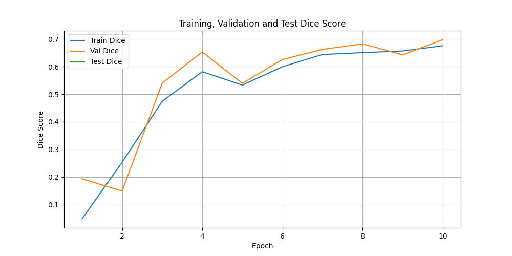
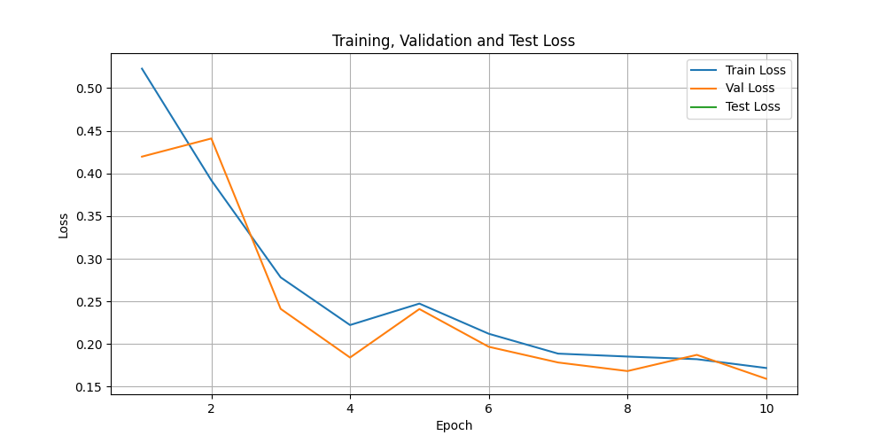
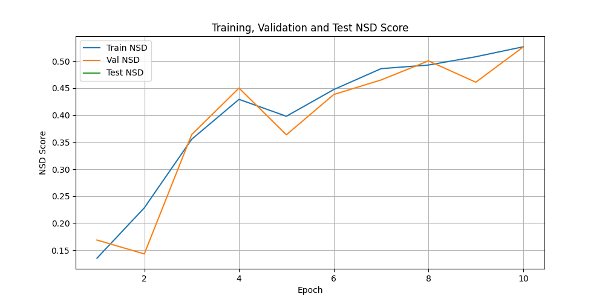

### MedVisionLlama (10% data, e10)

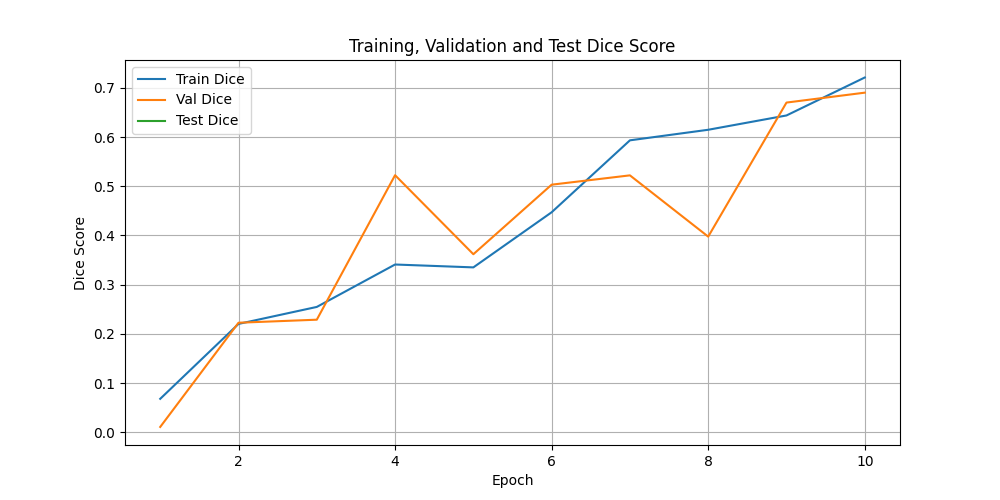
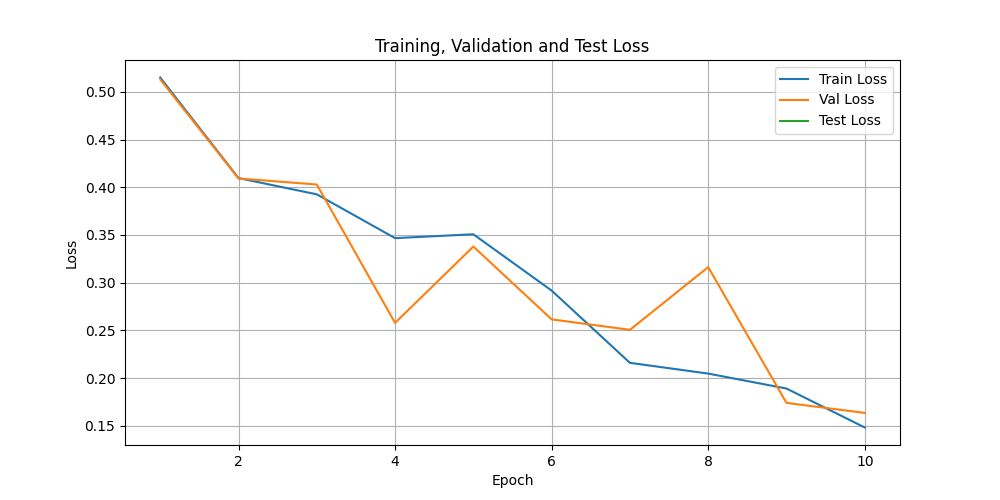
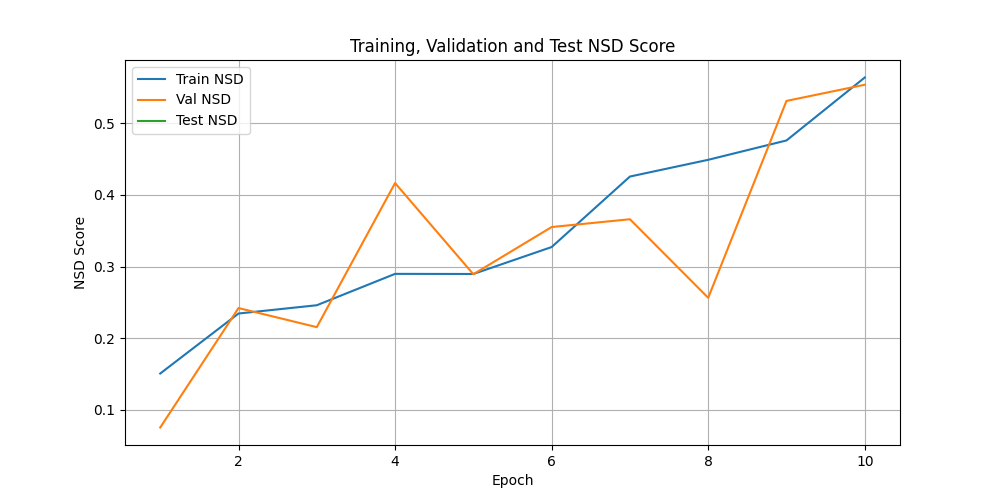

### ViT_Baseline (30% data)

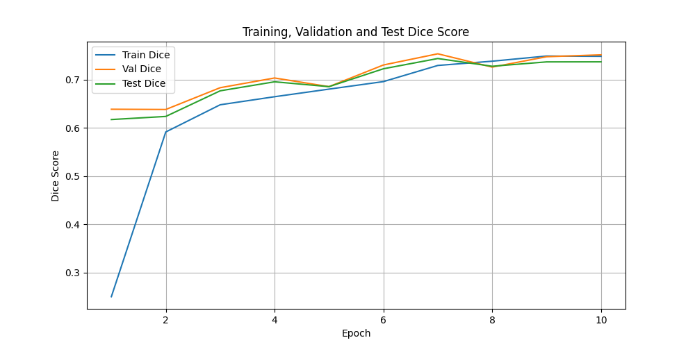
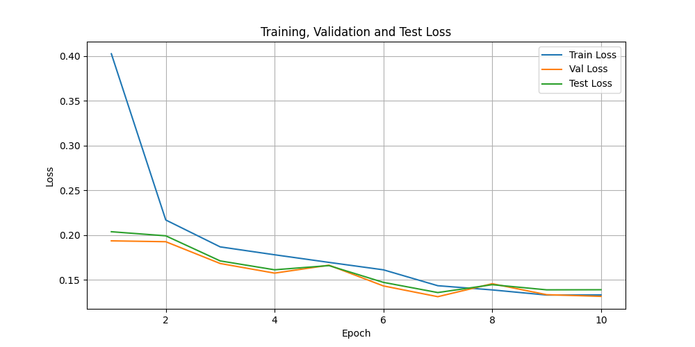
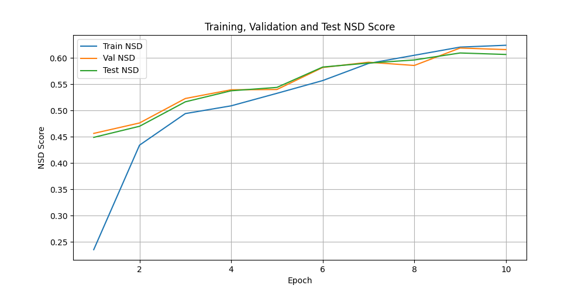

### MedVisionLlama (30% data)

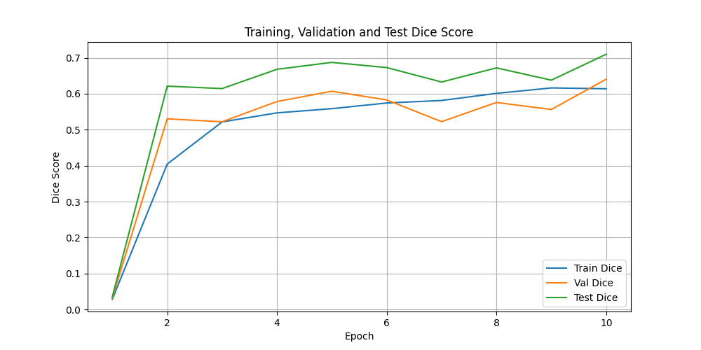
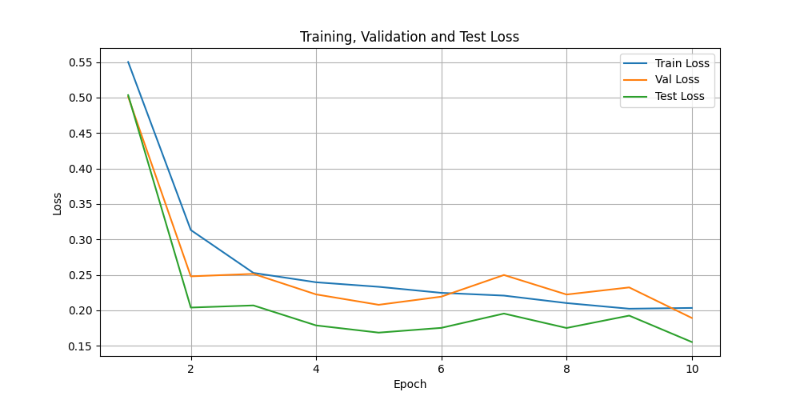
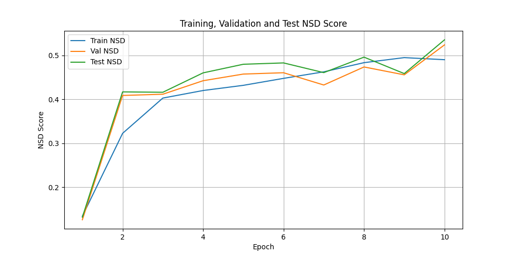

# 10. Completed Experiments / 已完成实验
- Task01_BrainTumour_ViT_Baseline
- Task01_BrainTumour_ViT_Baseline_e10
- Task01_BrainTumour_ViT_Baseline_30pct
- Task01_BrainTumour_ViT_Baseline_full_eval
- Task01_BrainTumour_MedVisionLlama_e10
- Task01_BrainTumour_MedVisionLlama_30pct
- Task01_BrainTumour_MedVisionLlama_full_eval

# 11. Limitations / 局限性
## 中文

当前复现仍有以下局限：

- 主要基于 Task01_BrainTumour
- 使用的是单卡 RTX PRO 6000 ×1
- 尚未扩展到更多 MSD 数据集
- 尚未完成多随机种子重复实验
- 当前结果仍不足以支持“严格论文级完全复现”
## English

Current limitations include:

- experiments are mainly based on Task01_BrainTumour
- only a single RTX PRO 6000 ×1 GPU was used
- more MSD datasets have not yet been evaluated
- repeated multi-seed validation is still missing
- the current evidence is not sufficient for a strict full paper-level reproduction claim

# 12. Future Work / 后续工作
- extend experiments to more MSD datasets
- standardize full evaluation more rigorously
- run repeated trials with different seeds
- investigate why MedVisionLlama_full_eval becomes unstable
- try settings closer to the original paper configuration

# 13. Repository Positioning / 仓库定位

This repository should be viewed as:

> ### paper reproduction + engineering validation + staged experimental analysis

本仓库定位为：

> ### 论文复现 + 工程验证 + 分阶段实验分析

It preserves not only the final results, but also the engineering debugging and experimental comparison process required to make the reproduction credible.

它不仅展示最终结果，也保留了使复现可信所必需的工程排障与实验对照过程。
